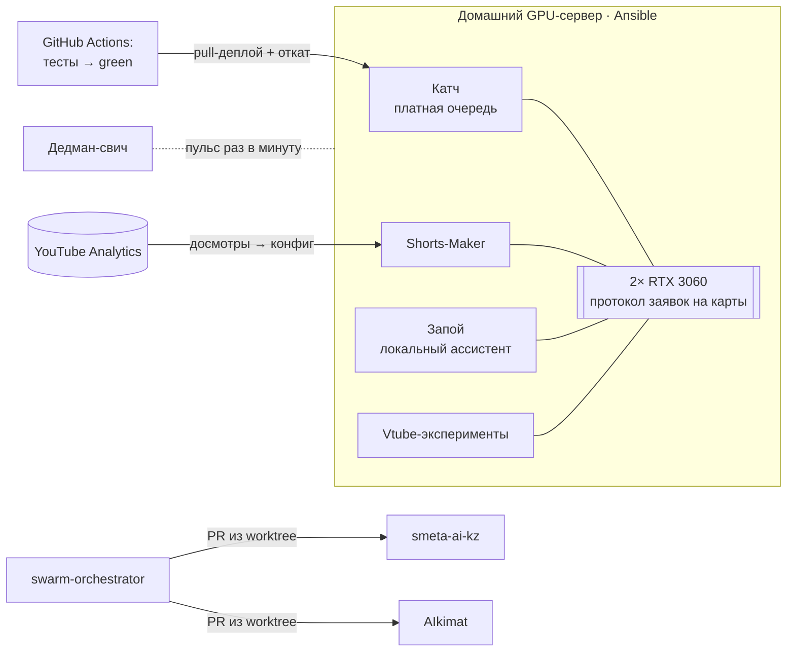

<h1 align="center">Георгий Толкачёв · DevOps / MLOps-инженер</h1>

  <b>Строю и эксплуатирую инфраструктуру, на которой работают LLM- и GPU-продукты:</b> 
  от сборки сервера и Ansible до автодеплоя с откатом, мониторинга и оценки качества моделей. 
  <i>I build and run the infrastructure that LLM and GPU products live on — <a href="https://github.com/zhoratolk/portfolio/blob/main/README.en.md">English version</a>.</i>

  
  
  

  
  
  
  
  
  
  
  

---

## Коротко

- **Собрал GPU-сервер с нуля** (2× RTX 3060, Xeon, Ubuntu 26.04) и описал его Ansible-плейбуком из
  8 ролей: `--check --diff` против живой машины показывает `changed=0`. На нём в продакшене работают
  три сервиса.
- **CI/CD с автоматическим откатом:** тесты → ветка `green` → сервер сам забирает изменения →
  двойной healthcheck → откат на предыдущий коммит, если сервис не поднялся. Идущие рендеры деплой
  не прерывает.
- **Выживаемость:** сторож на systemd, внешний дедман-свич на GitHub Actions, бэкапы 3-2-1 с
  шифрованием, постмортемы каждого падения.
- **LLM в продакшене с учётом денег:** цепочка провайдеров с circuit breaker'ом, бейк-офф локальной
  модели против облачной, себестоимость ~11 ₽ за трёхчасовую запись, оценка качества LLM-отбора в CI.
- **Петля от данных:** аналитика досмотров YouTube автоматически меняет параметры нарезки клипов.

## Как всё устроено

## Проекты

| | Проект | Что внутри |
|---|---|---|
| 🧬 | **[MLOps: полный цикл модели](https://github.com/zhoratolk/portfolio/blob/main/cases/ml-lifecycle.md)** | Датасет с первого дня, бейк-офф 7 моделей на своих данных (~70× разброс цены), версии по хэшу, три слоя оценки, дообучение голосовой модели RVC |
| 🔎 | **[RAG и память](https://github.com/zhoratolk/portfolio/blob/main/cases/rag.md)** | Гибридный поиск BGE-M3 + Qdrant (dense + sparse, RRF), трёхуровневая память, семантическая дедупликация |
| 🔁 | **[CI/CD](https://github.com/zhoratolk/portfolio/blob/main/cases/ci-cd.md)** | Ветка `green` как контракт доставки, pull-деплой с откатом, eval-гейт LLM в CI, дрейф Ansible |
| 🖥️ | **[Домашний GPU-сервер как код](https://github.com/zhoratolk/portfolio/blob/main/cases/gpu-server.md)** | Железо посчитано до покупки, 8 ролей Ansible, файрвол, который не отрезает сам себя, аренда GPU между проектами без общего кода |
| 🚀 | **[Катч — SaaS нарезки стримов](https://github.com/zhoratolk/portfolio/blob/main/cases/katch.md)** | Telegram-бот: VOD → шортсы 9:16. 2 200+ тестов, pull-деплой с откатом, бюджет NVENC-сессий, circuit breaker, eval harness |
| 🎬 | **[Shorts-Maker](https://github.com/zhoratolk/portfolio/blob/main/cases/shorts-maker.md)** | whisper large-v3 + диаризация ≈14× реального времени, рендер на NVENC, публикация через YouTube API, 1 260+ тестов |
| 🐝 | **[swarm-orchestrator](https://github.com/zhoratolk/swarm-orchestrator)** | Рой LLM-агентов разных моделей: кворум ревью ≥3, приёмка через реальный `verify_cmd`, фильтр секретов |
| 🛰️ | **[shortmaker-deadman](https://github.com/zhoratolk/shortmaker-deadman)** | Внешний сторож: пульс в gist + cron в Actions; замерил реальную задержку cron (медиана 163 мин) |
| 🎙️ | **[Запой](https://github.com/zhoratolk/portfolio/blob/main/cases/zapoy.md)** | Локальный ассистент: llama.cpp, Qdrant, STT/TTS в профилях compose, red-team на prompt injection |
| 📐 | **[smeta-ai-kz](https://github.com/zhoratolk/portfolio/blob/main/cases/smeta-ai-kz.md)** | AI-проверка смет: LLM отвечает только за семантику, цифры считает детерминированный код |
| 🏛️ | **[AIkimat](https://github.com/zhoratolk/portfolio/blob/main/cases/aikimat.md)** | On-premise ассистент для госоргана: LangGraph с согласованием человеком, методика расчёта GPU |
| 🏗️ | **[Air-gapped AI-контур](https://github.com/zhoratolk/portfolio/blob/main/cases/airgapped-design.md)** | Kubernetes + vLLM + KEDA: спроектировал и защитил, руководство выбрало интегратора |
| 📚 | **[manga-shorts](https://github.com/zhoratolk/portfolio/blob/main/cases/manga-shorts.md)** | Vision-модель смотрит сетки превью: ~8K токенов на главу |
| 🛒 | **[Dofamin Shop](https://github.com/zhoratolk/portfolio/blob/main/cases/dofamin-shop.md)** | Android (Next.js + Capacitor), парсер семи маркетплейсов прямо на устройстве, ~750 тестов |
| 🎭 | **[Vtube ACMT](https://github.com/zhoratolk/portfolio/blob/main/cases/vtube-acmt.md)** | Авториг VTuber-модели по 3D-голове, GPU-замеры, лицензионная разведка |
| 🚀 | **[Shakedown](https://github.com/zhoratolk/portfolio/blob/main/cases/shakedown.md)** | Рогалик на Godot 4.7: 16 фаз, 650+ тестов |

## Постмортемы

| Что сломалось | Почему | Как нашлось |
|---|---|---|
| Сервер трижды умер без единой строки в логах | Просадки электричества в квартире | По журналу питания **ноутбука**: два переключения на батарею совпали с гибелью сервера до секунды |
| Деплой бесконечно перезапускал сам себя | Холодная сборка на медленном канале шла дольше часового таймаута | Таймаут выставлен по худшему наблюдённому билду, плюс кэш pip в Dockerfile |
| Чистка облака удаляла файлы, но не строки в базе | Тестовая фикстура ошибалась так же, как код | 126 «мёртвых» строк → 65, ровно по числу живых файлов |
| Оценка LLM нашла баг, которого не было | Харнесс пропускал шаг, который есть в проде | Правило: харнесс повторяет прод шаг в шаг |

## Стек — честно по уровням

| Уровень | Технологии |
|---|---|
| **Эксплуатирую сам** | Linux, systemd, Bash, Docker / Compose, NVIDIA Container Toolkit, CUDA / NVENC, Ansible, GitHub Actions, ufw, Tailscale, SQLite, Python, FastAPI, faster-whisper, pyannote, ffmpeg, LangGraph, LLM API, бейк-офф моделей, eval harness, llama.cpp + GBNF, BGE-M3, Qdrant (гибридный поиск), RVC-дообучение |
| **Проектировал** | Kubernetes + GPU Operator, vLLM, KEDA, Harbor, Qdrant, Redis Streams, RabbitMQ / Celery |
| **Изучаю сейчас** | Kubernetes на практике, Terraform, Prometheus / Grafana / Loki |

---

Telegram <a href="https://t.me/joparo_me">@joparo_me</a> · Санкт-Петербург · удалённо или гибрид · рассматриваю переезд в Алматы

